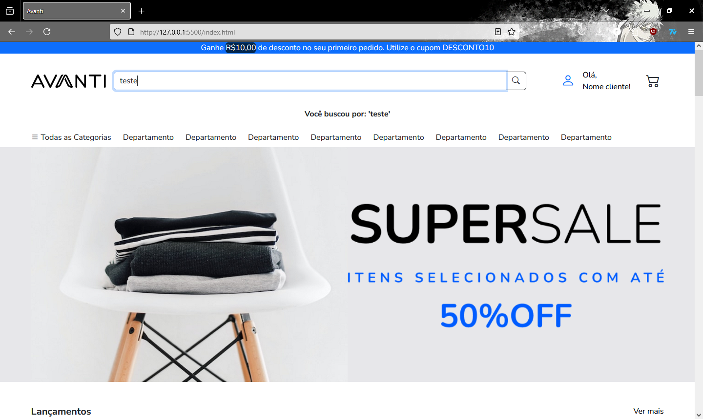
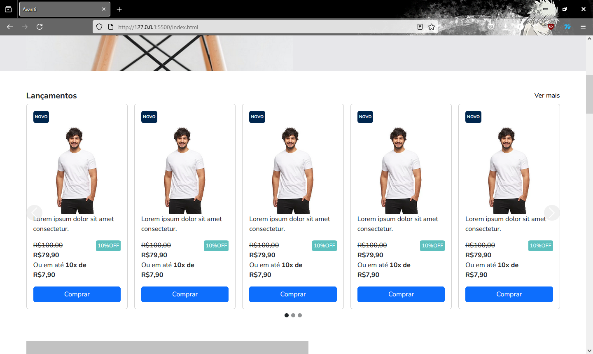
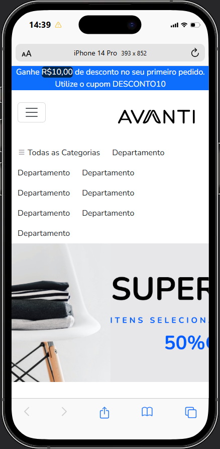
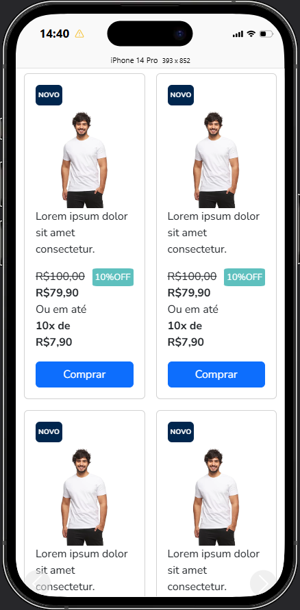
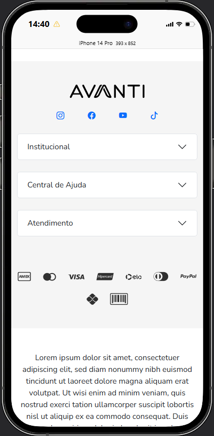

# Projeto 01 -  Desenvolvimento do Layout

Tecnologias utilizadas:

HTML, CSS + Bootstrap e Javascript

# Tela inicial:

HTML e CSS estruturado conforme o projeto do Figma, já apresentando a funcionalidade de busca com Javascript

# Carrossel

Interação dos carrosséis feita com Bootstrap e Javascript

# Responsividade

O projeto está responsivo, as imagens estão sendo simuladas em um iPhone 14 Pro

